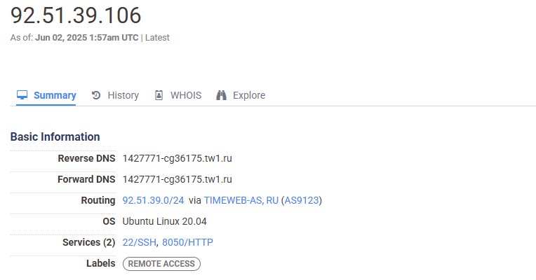

___

```
nmap -A -sV --version-all -O -p 8050 --reason -T4 --defeat-rst-ratelimit 92.51.39.106
```

___

<details>
<summary>screenshot Nmap(8050)</summary>
  


</details>

___

`8050`.

___

[NmapReport_8050](reports/nmap/nmap_report.txt)

___


## Тестирование NetologyVulnApp.com (8050)

### 1. Vulnerability - Unrestricted File Upload

**OWASP:** [A05:2021-Security Misconfiguration](https://owasp.org/Top10/A05_2021-Security_Misconfiguration/)

**Уровень риска:** Критический

**Целевая страница:** `http://92.51.39.106:8050/upload/`

**Краткое описание:**

Уязвимость **Unrestricted File Upload** позволяет загружать на веб-ресурс произвольные файлы, включая вредоносные, такие как шеллы, скрипты и другие типы файлов, которые изначально не предназначены для обработки. В рамках исследования этой уязвимости будет использован PHP-shell.

**Реализация:**

<details>
<summary>Пошаговая реализация</summary>

- **Step 1. Загрузка файла**
    
Переходим на страницу загрузки файла и заполняем все обязательные поля формы. Название и описание файла не имеют значения. В окне выбора файла выбираем заранее подготовленный PHP-шелл.

В моем случае это open-source PHP shell - [wso-webshell](https://github.com/mIcHyAmRaNe/wso-webshell)



- **Step 2. Возможность доступа**

Ранее на этапе сканирования веб-приложений, инструментом `FFUF`, была обнаружена уязвимая директория `/upload`, в которой и располагается наш ранее установленный shell.


    
- **Step 3. Запуск PHP-shell**

Открываем файл `wsoshell.php`


    
- **Step 4. Авторизация**

Вводим стандартный пароль `ghost287` и попадаем в графический интерфейс shell, в котором в дальнейшем и будем выполнять наши действия.
    

    
- **Step 5. Доступ к "чувствительным данным"**
    
Имея хоть и ограниченный, но довольно высокий уровень доступа, пробуем просмотреть файл `/etc/passwd`
    


- **Вывод**
    
Доступ к файлу получен, значит **уязвимость подтверждена**

(wso-webshell имеет гораздо больший функционал для дальнейшей эскалации, но в рамках выполнения дипломной работы, дальнейшая эскалация и нарушение работы приложения будут излишними.)
</details>

**Рекомендации по устранению:**

___

### 2. Vulnerability - Path Traversal

**OWASP:** [A01:2021-Broken Access Control](https://owasp.org/Top10/A01_2021-Broken_Access_Control/)

**Уровень риска:**

**Целевая страница:**

**Краткое описание:**

**Реализация:**

**Рекомендации по устранению:**

___

### 3. Vulnerability - Weak Admin Password

**OWASP:** [A07:2021-Identification and Authentication Failures](https://owasp.org/Top10/A07_2021-Identification_and_Authentication_Failures/)

**Уровень риска:**

**Целевая страница:**

**Краткое описание:**

**Реализация:**

**Рекомендации по устранению:**

___

### 4. Vulnerability - Insecure Transmission of Sensitive Data

**OWASP:** [A02:2021 – Cryptographic Failures](https://owasp.org/Top10/A02_2021-Cryptographic_Failures/)

**Уровень риска:**

**Целевая страница:**

**Краткое описание:**

**Реализация:**

**Рекомендации по устранению:**

___

### 5. Vulnerability - SQL Injection

**OWASP:** [A03:2021-Injection](https://owasp.org/Top10/A03_2021-Injection/)

**Уровень риска:**

**Целевая страница:**

**Краткое описание:**

**Реализация:**

**Рекомендации по устранению:**

___

### 6. Vulnerability - Brute Force Attack 

**OWASP:** [A07:2021-Identification and Authentication Failures](https://owasp.org/Top10/A07_2021-Identification_and_Authentication_Failures/)

**Уровень риска:**

**Целевая страница:**

**Краткое описание:**

**Реализация:**

**Рекомендации по устранению:**

___

### 7. Vulnerability - Cross-Site Scripting (XSS)

**OWASP:** [A03:2021-Injection](https://owasp.org/Top10/A03_2021-Injection/)

**Уровень риска:**

**Целевая страница:**

**Краткое описание:**

**Реализация:**

**Рекомендации по устранению:**

___

### 8. Vulnerability - Session Hijacking Attack 

**OWASP:** [A07:2021-Identification and Authentication Failures](https://owasp.org/Top10/A07_2021-Identification_and_Authentication_Failures/)

**Уровень риска:**

**Целевая страница:**

**Краткое описание:**

**Реализация:**

**Рекомендации по устранению:**

